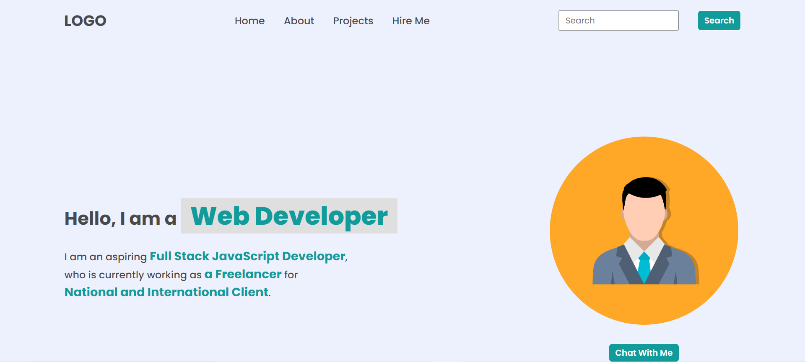
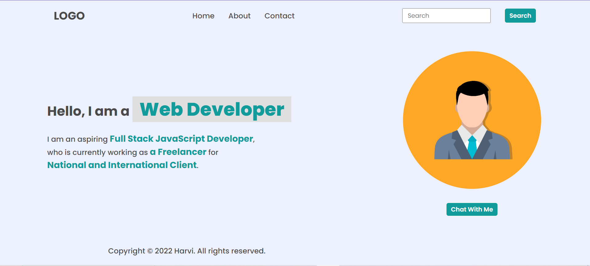
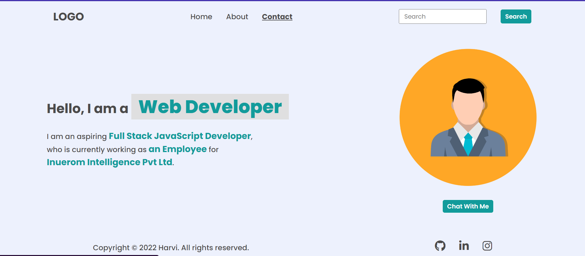
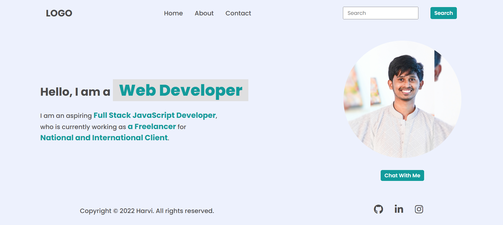
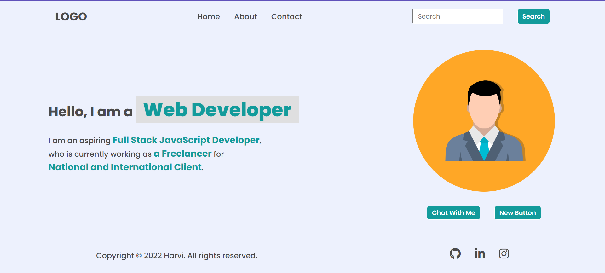
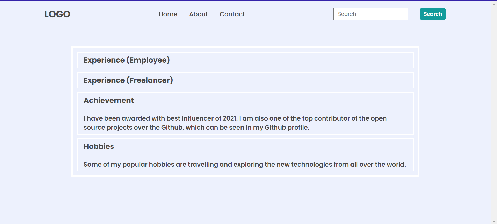
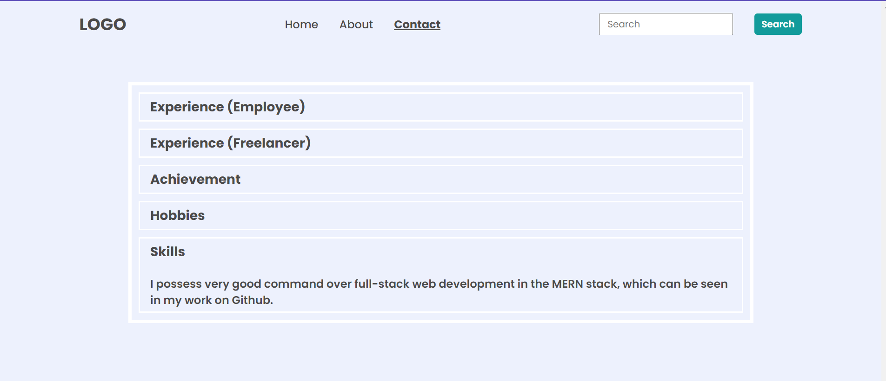
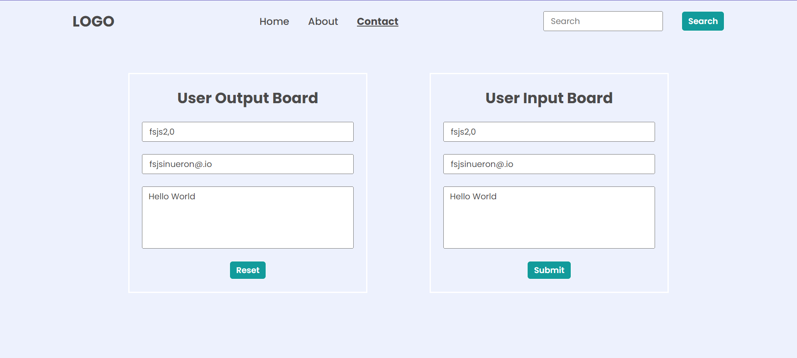

## FirstAssignment:
 **Task1** :
 
 **code** :
 
```const nav = document.querySelector("nav")
const Ul= nav.getElementsByTagName("ul")[0];
const contactLi = Ul.querySelector("li:last-child")
contactLi.remove()
const projectsLi = document.createElement("li")
projectsLi.innerHTML = '<a href="./projects/projects.html">Projects</a>'
const hireMeLi = document.createElement("li")
hireMeLi.innerHTML = '<a href="./hire-me/hire-me.html">Hire Me</a>'
navUl.appendChild(projectsLi)
navUl.appendChild(hireMeLi)
const footer = document.querySelector("footer");
footer.remove();
```
**Task2**


```
const footerUl = document.querySelector("footer ul")
const lis = footerUl.querySelectorAll("li")
lis.forEach(li => li.remove())
```

**Task3**



```
const heroLeftSection = document.querySelector(".hero-left-section")
const spans = heroLeftSection.getElementsByTagName("span")
spans[1].textContent = "Full Stack JavaScript Developer"
spans[2].textContent = "an Employee"
spans[3].textContent = "Inuerom Intelligence Pvt Ltd"
```

**Task4** :


```
const oldImg = document.querySelector("img")
const newImg = document.createElement("img")
newImg.src = "InShot_20221223_132011396.jpg"
newImg.alt = "New Image"
oldImg.parentNode.replaceChild(newImg, oldImg)
```

**Task5**:



```
const element = document.querySelector('.hero-right-section-btns')
  const newButton = document.createElement('button');
  newButton.textContent = "New Button"
  element.appendChild(newButton);
  ```

**task6** :

  ```
let achievementElement = document.querySelector(".accordian-wrapper .accordian:nth-child(3) h3");
let hobbyElement = document.querySelector(".accordian-wrapper .accordian:nth-child(4) h3");

achievemenElement.click()
hobbyElement.click()
```

**task7** :



```
let newAccordian = document.createElement("div");
newAccordian.className = "accordian";

let heading = document.createElement("h3");
heading.innerText = "Skills";

let para = document.createElement("p");
para.innerText = "I possess very good command over full-stack web development in the MERN stack, which can be seen in my work on Github.";

newAccordian.appendChild(heading);
newAccordian.appendChild(para);

let accordianWrapper = document.querySelector(".accordian-wrapper")
accordianWrapper.appendChild(newAccordian)

let newaccordianList = document.querySelectorAll(".accordian h3")

newaccordianList[4].addEventListener("click", function () {
  let content = this.nextElementSibling
  if (content.style.display === "block") {
  content.style.display = "none"
  } else {
  content.style.display = "block"
  }
  })
  (function () {
    newaccordianList[4].click();
  })()
  ```

  **task8** :
  

  ```
const userName = document.querySelector(".userName")
const userEmail = document.querySelector(".userEmail")
const userMessage = document.querySelector(".userMessage")
const enterName = document.querySelector(".enterName")
const enterMail = document.querySelector(".enterMail")
const enterMessage = document.querySelector(".enterMessage")
userName.value = "fsjs2.0"
userEmail.value = "fsjsinueron@.io"
userMessage.value = "Hello World"
enterName.value = userName.value
enterMail.value = userEmail.value
enterMessage.value = userMessage.value
```

