 **Task1** :
 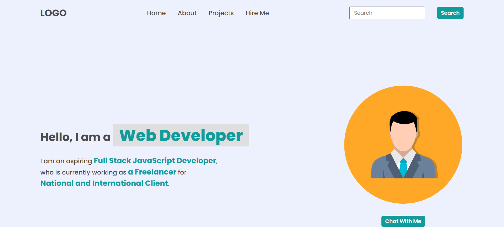
 **code** :
 
```const nav = document.querySelector("nav")
const Ul= nav.getElementsByTagName("ul")[0];
const contactLi = Ul.querySelector("li:last-child")
contactLi.remove()
const projectsLi = document.createElement("li")
projectsLi.innerHTML = '<a href="./projects/projects.html">Projects</a>'
const hireMeLi = document.createElement("li")
hireMeLi.innerHTML = '<a href="./hire-me/hire-me.html">Hire Me</a>'
navUl.appendChild(projectsLi)
navUl.appendChild(hireMeLi)
const footer = document.querySelector("footer");
footer.remove();
```
**Task2**


```
const footerUl = document.querySelector("footer ul")
const lis = footerUl.querySelectorAll("li")
lis.forEach(li => li.remove())
```

**Task3**


```
const heroLeftSection = document.querySelector(".hero-left-section")
const spans = heroLeftSection.getElementsByTagName("span")
spans[1].textContent = "Full Stack JavaScript Developer"
spans[2].textContent = "an Employee"
spans[3].textContent = "Inuerom Intelligence Pvt Ltd"
```

**Task4** :


```
const oldImg = document.querySelector("img")
const newImg = document.createElement("img")
newImg.src = "InShot_20221223_132011396.jpg"
newImg.alt = "New Image"
oldImg.parentNode.replaceChild(newImg, oldImg)
```

**Task5**:


```
const element = document.querySelector('.hero-right-section-btns')
  const newButton = document.createElement('button');
  newButton.textContent = "New Button"
  element.appendChild(newButton);
  ```

**task6** :

  ```
let achievementElement = document.querySelector(".accordian-wrapper .accordian:nth-child(3) h3");
let hobbyElement = document.querySelector(".accordian-wrapper .accordian:nth-child(4) h3");

achievemenElement.click()
hobbyElement.click()
```

**task7** :


```
let newAccordian = document.createElement("div");
newAccordian.className = "accordian";

let heading = document.createElement("h3");
heading.innerText = "Skills";

let para = document.createElement("p");
para.innerText = "I possess very good command over full-stack web development in the MERN stack, which can be seen in my work on Github.";

newAccordian.appendChild(heading);
newAccordian.appendChild(para);

let accordianWrapper = document.querySelector(".accordian-wrapper")
accordianWrapper.appendChild(newAccordian)

let newaccordianList = document.querySelectorAll(".accordian h3")

newaccordianList[4].addEventListener("click", function () {
  let content = this.nextElementSibling
  if (content.style.display === "block") {
  content.style.display = "none"
  } else {
  content.style.display = "block"
  }
  })
  (function () {
    newaccordianList[4].click();
  })()
  ```

  **task8** :
  

  ```
const userName = document.querySelector(".userName")
const userEmail = document.querySelector(".userEmail")
const userMessage = document.querySelector(".userMessage")
const enterName = document.querySelector(".enterName")
const enterMail = document.querySelector(".enterMail")
const enterMessage = document.querySelector(".enterMessage")
userName.value = "fsjs2.0"
userEmail.value = "fsjsinueron@.io"
userMessage.value = "Hello World"
enterName.value = userName.value
enterMail.value = userEmail.value
enterMessage.value = userMessage.value
```
## DOM4:
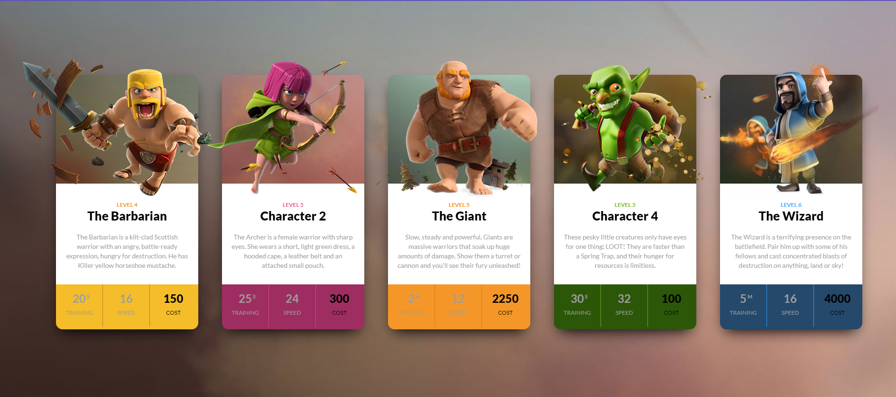
```
let ele1 = document.querySelector(".clash-card__unit-stats--barbarian")
let ele2 = document.querySelector(".clash-card__unit-stats--archer")
let ele3 = document.querySelector(".clash-card__unit-stats--giant ")
let ele4 = document.querySelector(".clash-card__unit-stats--goblin ")
let ele5 = document.querySelector(".clash-card__unit-stats--wizard")
ele1.style.backgroundColor = "#F4BD29"
ele2.style.backgroundColor = "#9E2E61"
ele3.style.backgroundColor = "#F49728"
ele4.style.backgroundColor = "#2C5708"
ele5.style.backgroundColor = "#24496B"
```
## DOM5 :
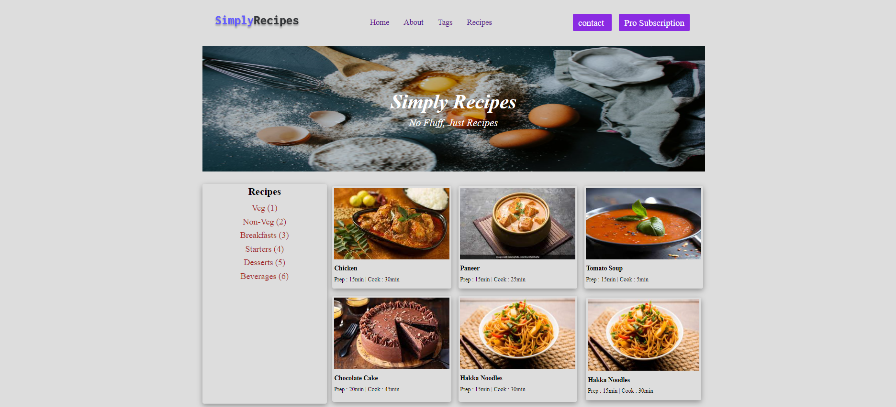

```
const parentDiv = document.querySelector('.nav-links').nextElementSibling;

const newButton = document.createElement('a');
newButton.href = "prosubscription.html";
newButton.textContent = "Pro Subscription";
newButton.classList.add("btn");
parentDiv.appendChild(newButton);
const gallery = document.querySelector('.recipe-gallery')
const newcard = document.createElement("div")
newcard.innerHTML = `<div class="card">
                    <a href="#" class="recipe-text">
                        
                        <h5 class="recipe-name">Hakka Noodles</h5>
                        <p class="recipe-disp">Prep : 15min | Cook : 30min</p>
                    </a>
                </div>`
gallery.appendChild(newcard)
```

## DOM6 :

 **task1** :


```
const logo = document.querySelector('.logo');
logo.src = "./assets/inueron-logo.png";

```
**TASK2** :

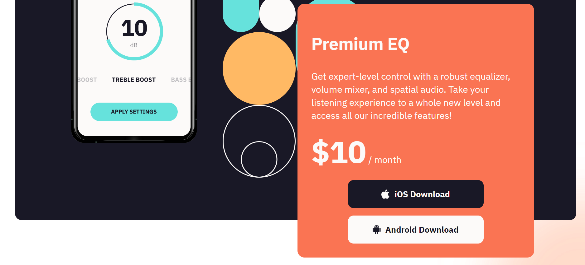
```
document.getElementsByClassName("app_price")[0].children[0].innerHTML="$10"
```

## DOM7 :

** TASK1 **:

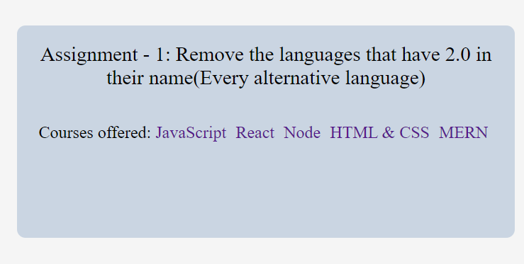

    ```
    const parent = document.querySelector(".main__languages");
        const childs = parent.querySelectorAll("a");
        childs.forEach((a) => {
          if (a.textContent.includes("2.0")) {
            parent.removeChild(a);
          }
        })
        ```
** TASK**:

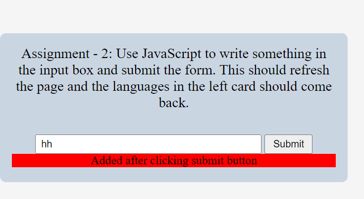
```
const form = document.querySelector("form")
        const formBtn = document.querySelector(".main__form-btn");
        const formInput = document.querySelector (".main__form-input")
        formBtn.removeAttribute("disabled");
        formInput.removeAttribute("disabled");
        form.onsubmit = function (e){
             e.preventDefault()
         let newDiv= document.createElement("div");
         newDiv.style.backgroundColor ="red"
         newDiv.innerText="Added after clicking submit button" ;
         let form =document.querySelector(".main__form")
         form.appendChild(newDiv) 
        }
  ```
## DOM8 :

**TASK1** :

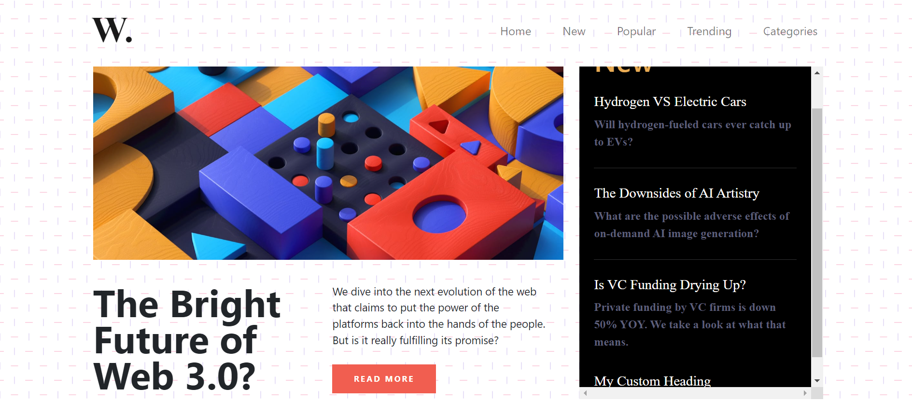


```
const aside = document.querySelector('.col-lg-4.new');
const h2 = document.createElement('h2')
h2.classList.add('new-head')
h2.textContent = "My Custom Heading"
aside.style.overflowX = "scroll"
aside.appendChild(h2)
```

**TASK2**:
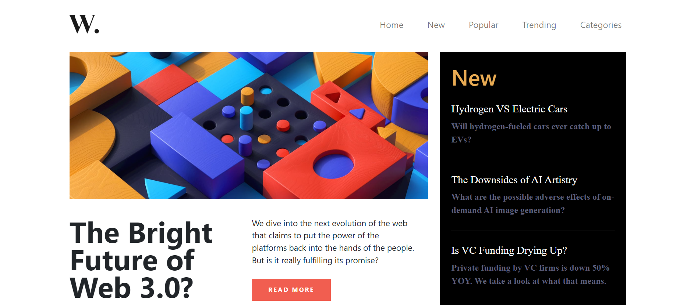
```
document.body.style.backgroundImage="none"
```

**TASK3** :

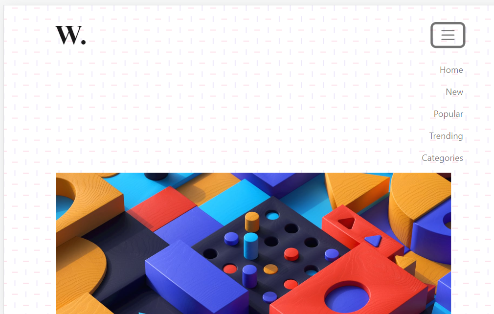

```
const hambergerMenu = document.querySelector(".navbar-toggler")
       hambergerMenu.addEventListener("click", function(){
          const ulDiv = document.getElementById("navbarTogglerDemo01")
          if(ulDiv.style.display=="none"){
          ulDiv.style.display="block";
          }
          else{
            ulDiv.style.display="none";
          }
       })
 ```      

## DOM9 :
 

 **TASK1** :
 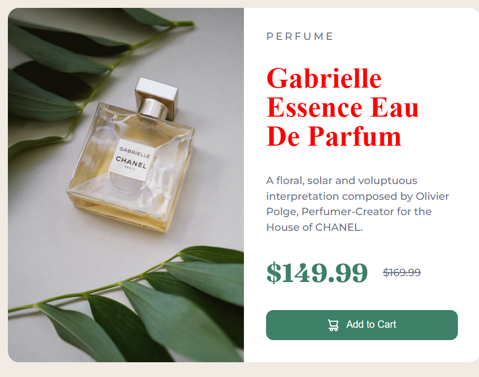

 ```
const h1Element = document.querySelector("h1")
h1Element.style.color = "red"
h1Element.style.fontFamily="none"
 ```
 
 **TASK2** :
 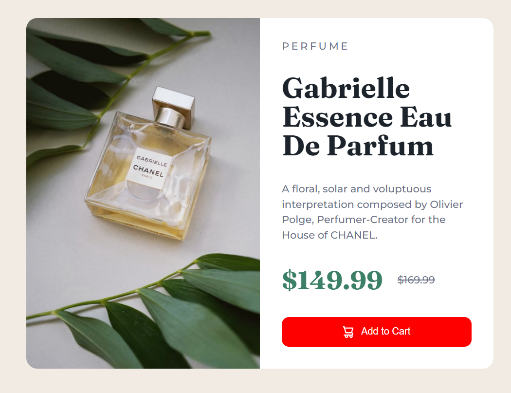

 ```
const buttonElement = document.querySelector("button")
buttonElement.style.backgroundColor = "red"
```


