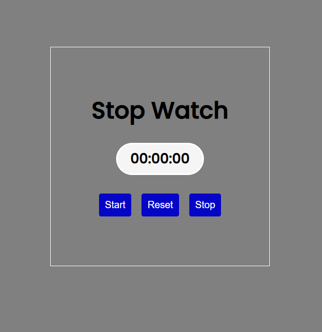
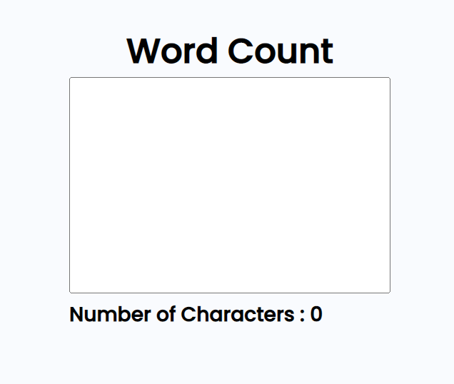
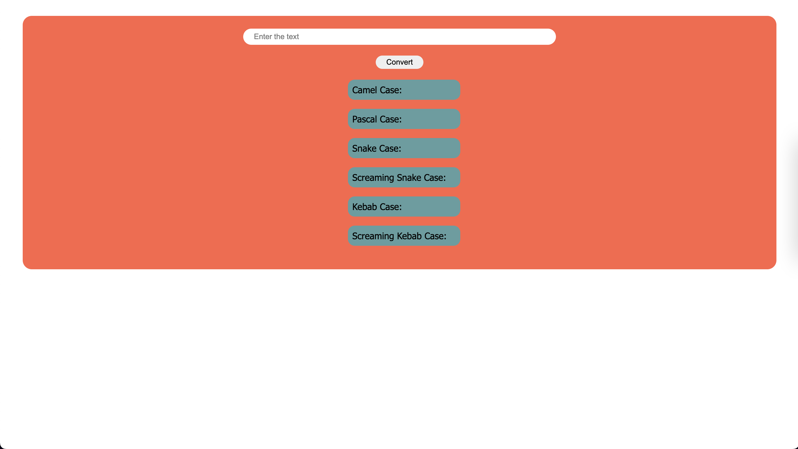
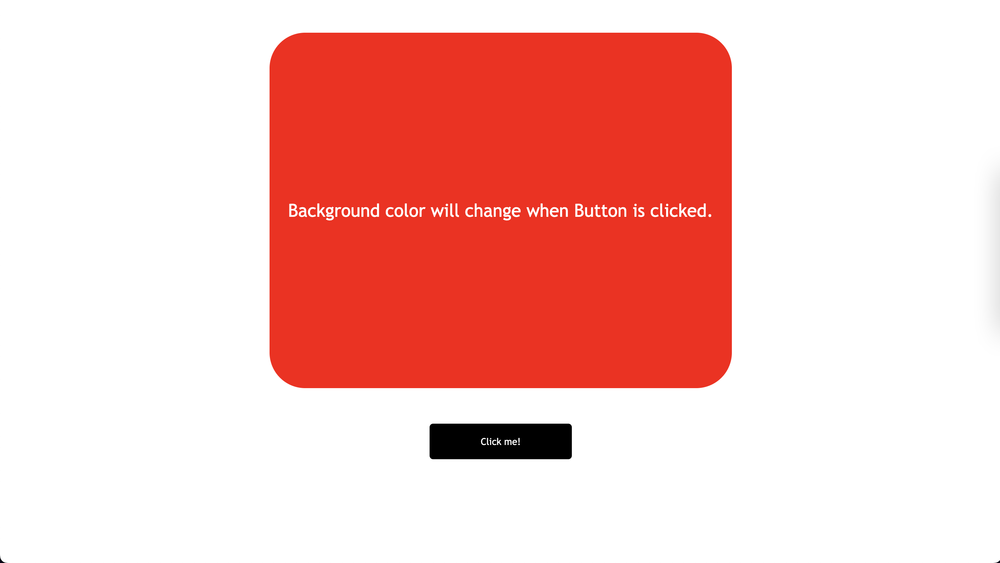

## Javascript projects

## Project-1 : Simple polindrome check app
   It helps to check whether given value in the input is polindrome or not.

   **Built with**: Html , css, Javascript

  

  [Live Link](https://jocular-dolphin-7d12f5.netlify.app/)

  ## Project-2:## Simple Stop watch app

   **Built with**: Html , css, Javascript

  
[Live Link](https://relaxed-praline-07658d.netlify.app/)

## Project-3: Simple word count app

   **Built with**: Html , css, Javascript

  

[live link](https://stirring-kheer-09d4dd.netlify.app/)

##  Calculator 
**Built with**: 
HTML CSS JS

[live link](https://stunning-salamander-cec358.netlify.app/)

## Shadeup
# RGB to Hex Converter

This webpage allows you to easily convert RGB colors to hexadecimal and vice versa. It also includes a random color picker to help you discover new color combinations.

## Features

- Convert RGB colors to hexadecimal
- Convert hexadecimal colors to RGB
- It also allows you to enter a hexadecimal and RGB color value and see the     resulting color displayed on the page.
- Pick a random color and see the corresponding RGB and hexadecimal values

## Usage

To use the RGB to hex converter, simply enter the red, green, and blue values of the RGB color in the input fields and click the "Convert" button. The hexadecimal value will be displayed in the output field.

To convert a hexadecimal color to RGB, enter the hexadecimal value in the input field and click the "Convert " button. The red, green, and blue values of the RGB color will be displayed in the output fields. 

To use the color display, simply enter a hexadecimal or RGB color value in the input field and press the "show" button. The color display will update to show the corresponding color.

You can also click the "Random Color" button to have the color display show a randomly generated color.

To pick a random color, click the "Hit Me" button. The corresponding RGB and hexadecimal values of the random color will be displayed in the output fields.

## Technologies

This webpage is built using HTML, CSS, and JavaScript. It makes use of the following libraries:

- [Bootstrap](https://getbootstrap.com/)

[live link](https://legendary-faloodeh-0a3d33.netlify.app/)

## Quiz App

A simple quiz app that allows users to test their knowledge  , created with html css and javascript.

[Live link](https://aquamarine-macaron-ee89ba.netlify.app/) 

## BASIC COUNTER 

**Built with :** HTML CSS , JAVASCRIPT

 

[LIVE LINK](https://gentle-cat-86f185.netlify.app/)

# See What You Type

This application allows the user to see the text they type in real-time.

## Input
- A textarea where the user can enter text

## Output
- The text entered in the textarea is displayed below the input field in real-time

## Functionality
- The JavaScript function "update()" is called on the "oninput" event of the textarea, which updates the output paragraph with the current text in the textarea.
- The CSS file "style.css" styles the layout and appearance of the application.

[LIVE LINK](https://snazzy-blini-383558.netlify.app/)

# Name Conversion

This application was built using JavaScript, CSS, and HTML.

## Input
- An input field where the user can enter text
- A "Convert" button to initiate the name conversion process

## Output
- Six different name cases displayed in separate sections:
    - Camel Case
    - Pascal Case
    - Snake Case
    - Screaming Snake Case
    - Kebab Case
    - Screaming Kebab Case

## Functionality
- The JavaScript file "nameConversion.js" handles the logic for converting the entered text into the various name cases.
- The CSS file "index.css" styles the layout and appearance of the application.

[LIVE LINK](https://legendary-torte-28d6af.netlify.app/)

## JOKES GENERATOR

BUILT WITH HTML CSS JAVASCRIPT
 A random joke is generated whenever you click the button.

[live link](https://silver-kitten-37ee85.netlify.app/)

## COLORCHANGER

BUILT WITH HTML CSS JAVASCRIPT

Displays a random color each time you click the button click me!

[LIVE LINK](https://superb-gumption-7a919c.netlify.app/)

## ClickTheButton

BUILT WITH HTML CSS JAVASCRIPT

Displays how many times you have clicked the button

[LIVE LINK](https://chimerical-cendol-f8278d.netlify.app/)

# Name Conversion

This application was built using JavaScript, CSS, and HTML.

## Input
- An input field where the user can enter text
- A "Convert" button to initiate the name conversion process

## Output
- Six different name cases displayed in separate sections:
    - Camel Case
    - Pascal Case
    - Snake Case
    - Screaming Snake Case
    - Kebab Case
    - Screaming Kebab Case

## Functionality
- The JavaScript file "nameConversion.js" handles the logic for converting the entered text into the various name cases.
- The CSS file "index.css" styles the layout and appearance of the application.

[LIVE LINK](https://legendary-torte-28d6af.netlify.app/)